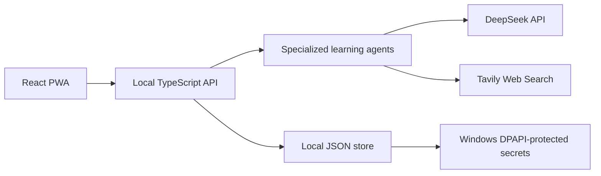

<div align="center">

# Learning Studio

**An AI-native workspace that turns a learning goal into a structured course, complete lessons, practice, and contextual tutoring.**

[English](./README.md) · [简体中文](./README.zh-CN.md)

[](https://react.dev/)
[](https://www.typescriptlang.org/)
[](https://vite.dev/)
[](./public/manifest.webmanifest)
[](./LICENSE)
[](https://github.com/civilization-os/learning-studio)

</div>

Learning Studio is a local-first web application for building and following personalized learning paths. Enter a topic, let specialized AI agents draft a progressive curriculum, adjust it with human control, and then learn through generated explanations, examples, exercises, and a tutor that understands the current lesson.

> [!NOTE]
> The product interface currently targets Simplified Chinese. The source code and documentation are ready for community-driven localization; see [Internationalization](#internationalization).

## Highlights

- **Goal-to-course workflow** — generate a useful project description and a complete chapter structure from a topic.
- **Web Search-assisted outlines** — optionally use Tavily results to improve coverage and timeliness.
- **Progressive curriculum design** — chapters advance from foundations to application, with star-based difficulty and estimated study time.
- **Human-controlled editing** — add, rename, reorder, or remove nodes before starting a course.
- **Focused AI polishing** — improve the wording of manually added outline nodes without rewriting the entire curriculum.
- **Generated lesson experiences** — create mind maps, core explanations, examples, and interactive exercises for each section.
- **Contextual AI tutor** — ask for a simpler explanation, an example, a summary, or a new question based on the current lesson.
- **Official model discovery** — load available models from the configured DeepSeek `/models` endpoint instead of hard-coding model names.
- **Local persistence** — store projects and learning progress locally; protect saved API keys with Windows DPAPI.
- **Responsive PWA interface** — installable app shell with layouts designed for mobile, desktop, and ultra-wide screens.

## How it works



The frontend never writes provider keys into browser storage or project files. It talks to a local backend, which coordinates agents, calls external providers, caches generated lesson content, and persists project state.

## Agent roles

| Agent | Responsibility |
| --- | --- |
| Project Creator | Generates a concise project description from the topic name |
| Learning Planner | Frames the learning goal and expected progression |
| Outline Agent | Builds a complete, progressively harder curriculum with optional Web Search context |
| Course Content Agent | Produces the current section's map, explanation, example, and exercise |
| Tutor Agent | Answers questions using the active project, chapter, section, and generated lesson |
| Exercise Agent | Supports practice-oriented learning interactions |

## Requirements

- [Node.js](https://nodejs.org/) 18 or newer
- npm
- A DeepSeek API key for AI generation
- Optional: a Tavily API key for Web Search-assisted outlines
- Windows 10/11 is recommended when saving credentials through the UI because the current secure persistence layer uses Windows DPAPI

On non-Windows systems, provider keys can be supplied through environment variables, but the current version cannot securely persist newly entered keys from the settings page.

## Quick start

```bash
git clone https://github.com/civilization-os/learning-studio.git
cd learning-studio
npm install
npm run dev
```

The development launcher compiles and starts both services:

- Frontend: `http://localhost:5173`
- Backend API: `http://127.0.0.1:8787`

Open **Settings** in the app, enter your DeepSeek API key, load the official model list, test the connection, and save the configuration. Add a Tavily key only if you want Web Search enrichment.

### Environment variables

Environment variables are useful for automation or systems where UI-based secret persistence is unavailable.

| Variable | Purpose | Default |
| --- | --- | --- |
| `DEEPSEEK_API_KEY` | DeepSeek API credential | — |
| `DEEPSEEK_BASE_URL` | OpenAI-compatible DeepSeek endpoint | `https://api.deepseek.com` |
| `TAVILY_API_KEY` | Tavily Web Search credential | — |
| `PORT` | Local backend port | `8787` |
| `APP_STORE_PATH` | Custom path for the local JSON store | `server/data/store.json` |
| `VITE_API_BASE_URL` | Frontend API base URL | `http://127.0.0.1:8787/api` |

PowerShell example:

```powershell
$env:DEEPSEEK_API_KEY = "your-key"
$env:TAVILY_API_KEY = "your-key"
npm run dev
```

Do not commit `.env` files or credentials. The repository's `.gitignore` excludes local environment files and runtime data.

## Available commands

| Command | Description |
| --- | --- |
| `npm run dev` | Compile the backend and run the frontend and backend together |
| `npm run dev:web` | Run only the Vite frontend |
| `npm run server:dev` | Compile and run only the local backend |
| `npm run dev:check` | Verify that the combined development launcher can start |
| `npm run build` | Type-check and create the production frontend bundle |
| `npm run server:build` | Compile the backend |
| `npm run test:server` | Run the server and Web Search outline smoke tests |
| `npm run preview` | Preview the production frontend bundle |

## Project structure

```text
learning-studio/
├─ public/                 # PWA manifest, service worker, and icons
├─ scripts/                # Combined development launcher
├─ server/
│  ├─ src/agents/          # Specialized learning agents
│  ├─ src/                 # API, provider clients, storage, and secret protection
│  └─ tests/               # Backend smoke tests
├─ src/
│  ├─ components/ui/       # Reusable interface primitives
│  ├─ App.tsx              # Product flows and page composition
│  ├─ api.ts               # Frontend API client
│  ├─ storage.ts           # Safe browser-side preferences
│  └─ styles.css           # Responsive visual system
└─ DESIGN.md               # Product and interface design direction
```

## Data and security

- Projects and non-secret settings are stored in `server/data/store.json` by default.
- DeepSeek and Tavily keys saved through the Windows UI are encrypted for the current Windows user with DPAPI.
- Raw API keys are removed from browser persistence and are not written to project files.
- `server/data/`, `.env*`, build output, and browser-test artifacts are excluded from Git.
- The local backend binds to the loopback interface by default.

This is an early-preview local application, not a multi-tenant hosted service. Review the security model before exposing the backend to a network.

## Internationalization

Documentation is available in:

- [English](./README.md)
- [简体中文](./README.zh-CN.md)

The application UI currently uses Simplified Chinese copy. Contributions for additional locales should:

1. Extract user-facing strings into locale modules such as `src/locales/en-US.ts`.
2. Keep one shared component and interaction implementation; do not fork pages by language.
3. Use `zh-CN` as the fallback until a dedicated localization layer is merged.
4. Preserve local date, time, number, and study-duration conventions.
5. Add the new documentation language to the selector at the top of every README translation.

## Contributing

Issues and pull requests are welcome. Before submitting a change:

```bash
npm run build
npm run test:server
```

Please keep secrets, generated runtime data, and local test screenshots out of commits.

## License

Learning Studio is released under the [MIT License](./LICENSE).
