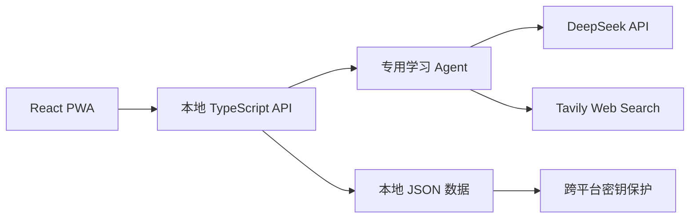

<div align="center">

# Learning Studio

**一个由 AI 驱动的学习工作台：从学习目标出发，生成完整课程、学习内容、练习与上下文助教。**

[English](./README.md) · [简体中文](./README.zh-CN.md)

[](https://react.dev/)
[](https://www.typescriptlang.org/)
[](https://vite.dev/)
[](./public/manifest.webmanifest)
[](./LICENSE)
[](https://github.com/civilization-os/learning-studio)

</div>

Learning Studio 是一款本地优先的 Web 学习应用。输入一个课题后，多个专用 Agent 会生成难度递进的完整课程；用户可以自行调整大纲，并在学习过程中获得 AI 生成的讲解、示例、练习和理解当前小节上下文的助教。

> [!NOTE]
> 当前产品界面以简体中文为主。项目欢迎社区参与多语言改造，具体约定请参阅[国际化](#国际化)。

## 核心能力

- **从课题到课程**：按照课题名称生成内容描述、学习目标和完整章节结构。
- **Web Search 增强大纲**：可选使用 Tavily 搜索结果，提高课程覆盖度与时效性。
- **难度递进设计**：章节从基础到应用逐步深入，并用星级难度和预计学习时长表达学习强度。
- **保留人工控制**：开始学习前可以新增、改名、排序或删除大纲节点。
- **定点 AI 润色**：只优化用户手动添加节点的语言描述，不会重写整篇大纲。
- **完整小节内容生成**：为当前小节生成思维导图、核心讲解、示例和互动练习。
- **上下文 AI 助教**：围绕当前课程、小节和已生成内容进行简化讲解、举例、总结或出题。
- **官方模型获取**：从已配置的 DeepSeek `/models` 接口读取可用模型，不在代码中写死模型名称。
- **本地数据持久化**：在本地保存项目和学习进度，并通过 Windows DPAPI 或 AES-256-GCM 保护 API Key。
- **响应式 PWA**：支持安装，并针对手机、桌面和超宽屏提供自适应布局。

## 工作方式



前端不会把服务商密钥写入浏览器存储或项目文件。前端只与本地后端通信，由后端协调各 Agent、调用外部服务、缓存小节内容并持久化项目状态。

## Agent 分工

| Agent | 职责 |
| --- | --- |
| 项目创建 Agent | 根据课题名称生成简洁、可执行的内容描述 |
| 学习规划 Agent | 确定学习目标和递进路径 |
| 大纲 Agent | 结合可选 Web Search 上下文生成完整、难度递进的课程 |
| 课程内容 Agent | 生成当前小节的思维导图、讲解、示例与练习 |
| 助教 Agent | 使用当前项目、章节、小节和课程内容回答问题 |
| 练习 Agent | 支持以练促学的互动流程 |

## 环境要求

- [Node.js](https://nodejs.org/) 18 或更高版本
- npm
- DeepSeek API Key，用于 AI 生成功能
- 可选：Tavily API Key，用于 Web Search 大纲增强
- Windows 10/11；Linux 如需从设置页保存密钥，需要配置 `APP_ENCRYPTION_KEY`

## 快速开始

```bash
git clone https://github.com/civilization-os/learning-studio.git
cd learning-studio
npm install
npm run dev
```

开发启动器会编译并同时运行两个服务：

- 前端：`http://localhost:5173`
- 后端 API：`http://127.0.0.1:8787`

进入应用的“设置”页面，填写 DeepSeek API Key，获取官方模型列表，测试连接并保存配置。如果需要 Web Search 增强，再填写 Tavily API Key。

### Docker 一键部署

Docker 部署使用 Nginx 提供单一访问入口，并通过数据卷保存学习数据：

```bash
cp deploy/docker.env.example .env
node -e "console.log(require('node:crypto').randomBytes(32).toString('base64'))"
# 将输出写入 .env 的 APP_ENCRYPTION_KEY
docker compose up -d --build
```

默认访问 `http://127.0.0.1:8080`。需要局域网或公网部署时，请先阅读完整的 [Docker 部署指南](./docs/docker-deployment.zh-CN.md)。

### 环境变量

环境变量适用于自动化场景，或无法使用界面安全持久化密钥的系统。

| 变量 | 用途 | 默认值 |
| --- | --- | --- |
| `DEEPSEEK_API_KEY` | DeepSeek API 密钥 | — |
| `DEEPSEEK_BASE_URL` | OpenAI 兼容的 DeepSeek 接口地址 | `https://api.deepseek.com` |
| `TAVILY_API_KEY` | Tavily Web Search 密钥 | — |
| `APP_ENCRYPTION_KEY` | Linux 持久化密钥所需的 32 字节 Base64/十六进制密钥 | — |
| `PORT` | 本地后端端口 | `8787` |
| `HOST` | 后端监听地址 | `127.0.0.1` |
| `CORS_ORIGINS` | 前后端分离时允许的浏览器来源，逗号分隔 | 本地 Vite 地址 |
| `APP_STORE_PATH` | 本地 JSON 数据文件自定义路径 | `server/data/store.json` |
| `VITE_API_BASE_URL` | 前端请求的 API 地址 | `/api` |

PowerShell 示例：

```powershell
$env:DEEPSEEK_API_KEY = "your-key"
$env:TAVILY_API_KEY = "your-key"
npm run dev
```

请勿提交 `.env` 文件或任何真实密钥。仓库的 `.gitignore` 已排除本地环境变量文件和运行数据。

## 可用命令

| 命令 | 说明 |
| --- | --- |
| `npm run dev` | 编译后端，并同时启动前端与后端 |
| `npm run dev:web` | 只启动 Vite 前端 |
| `npm run server:dev` | 编译并启动本地后端 |
| `npm run dev:check` | 检查前后端联合开发启动流程 |
| `npm run build` | 类型检查并生成前端生产构建 |
| `npm run server:build` | 编译后端 |
| `npm run test:server` | 运行服务端与 Web Search 大纲冒烟测试 |
| `npm run preview` | 预览前端生产构建 |

## 项目结构

```text
learning-studio/
├─ public/                 # PWA 清单、Service Worker 和图标
├─ scripts/                # 前后端联合开发启动器
├─ server/
│  ├─ src/agents/          # 专用学习 Agent
│  ├─ src/                 # API、服务商客户端、数据与密钥保护
│  └─ tests/               # 后端冒烟测试
├─ src/
│  ├─ components/ui/       # 可复用界面基础组件
│  ├─ App.tsx              # 产品流程与页面组合
│  ├─ api.ts               # 前端 API 客户端
│  ├─ storage.ts           # 安全的浏览器端偏好设置
│  └─ styles.css           # 响应式视觉系统
└─ DESIGN.md               # 产品与界面设计方向
```

## 数据与安全

- 项目和非敏感配置默认保存在 `server/data/store.json`。
- Windows 使用当前用户的 DPAPI 加密从设置页保存的 DeepSeek 与 Tavily 密钥。
- Linux 使用 AES-256-GCM，并要求部署者提供稳定的 `APP_ENCRYPTION_KEY`。
- 原始 API Key 不会进入浏览器持久化存储，也不会写入项目文件。
- `server/data/`、`.env*`、构建产物和浏览器测试产物均不会提交到 Git。
- 本地后端默认只监听回环地址。

当前项目属于本地运行的早期预览版本，并非多租户托管服务。将后端暴露到网络前，请先重新评估安全模型。

## 国际化

当前文档语言：

- [English](./README.md)
- [简体中文](./README.zh-CN.md)

产品 UI 当前使用简体中文。新增语言时请遵循以下约定：

1. 将面向用户的字符串抽取到 `src/locales/en-US.ts` 等 locale 模块。
2. 不要为不同语言复制页面，所有语言应共享同一套组件和交互实现。
3. 在完整的本地化层合入前，以 `zh-CN` 作为回退语言。
4. 保留不同地区的日期、时间、数字与学习时长表达习惯。
5. 在所有 README 翻译顶部同步增加新的文档语言入口。

## 参与贡献

欢迎提交 Issue 和 Pull Request。提交前请运行：

```bash
npm run build
npm run test:server
```

请勿在提交中包含密钥、运行数据或本地测试截图。

## 许可证

Learning Studio 使用 [MIT License](./LICENSE)。
